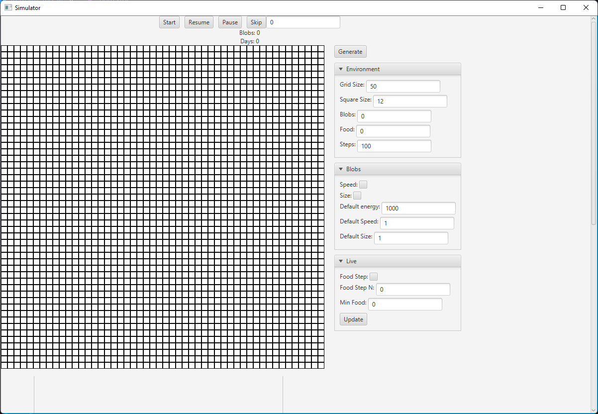
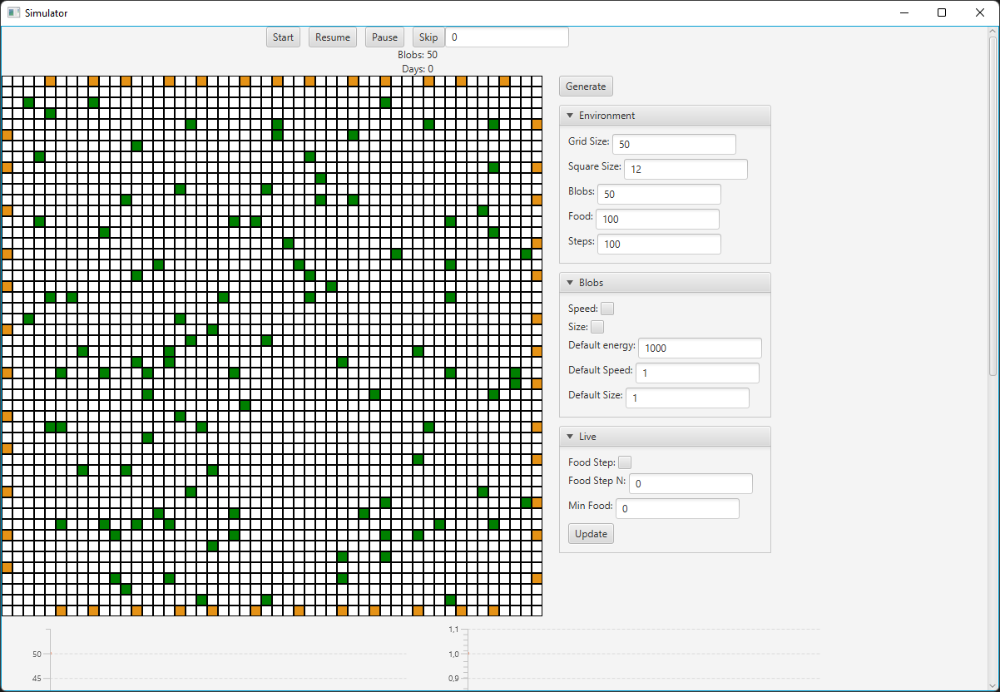
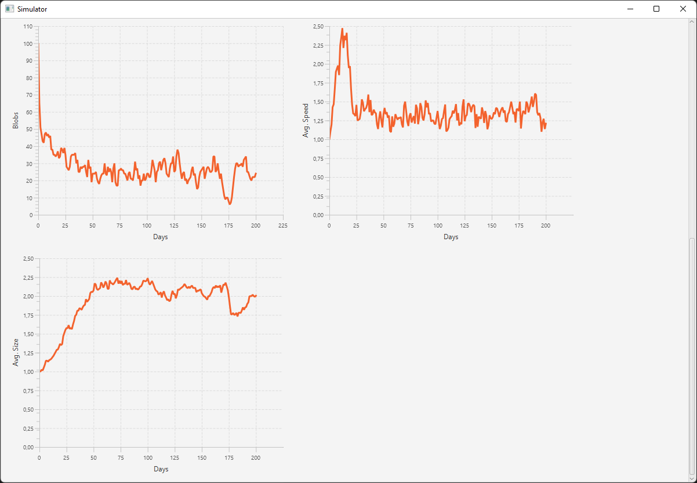

To run the project:
    
    mvn clean javafx:run

# Charles Darwin Theory
Natural selection is a fundamental concept in evolutionary biology, first proposed by Charles Darwin. It explains how species evolve over time through the differential survival and reproduction of individuals with certain traits. In essence, individuals in a population exhibit variations in their traits, such as size or speed. Some of these traits provide advantages in a particular environment, increasing the likelihood of survival and reproduction. Offspring inherit these advantageous traits, making them more common in subsequent generations. Over time, this process can lead to significant changes in the species, even resulting in the formation of new species.

# Simulator
The "Natural Selection Simulator" project is designed based on the principles of the natural selection theory.



The program can simulate the natural selection in a defined environment (represented by the grid) of a specific species (called Blobs) with different traits (speed and size).

The buttons at the top control the simulation, `Blobs: 0` stat defines how many Blobs are alive at the current time in the current environment, `Days: 0` stat defines how many days have passed from the start of the simulation.

The environment can be generated from the right panel with the defined options.

# Implementation and Rules
It is generated a specific environment with defined size, number of starting blobs and number of food for each day. Each day the blobs (which can have different colors depending on the traits properties, by default their color is orange) are placed evenly at the borders of the grid (environment) and the food (color green) is placed randomly in the environment



The simulation time is measured in steps, by default a day is made of 100 steps.
When the simulation is started, each step a blob moves randomly by a defined number of squares (depending on the speed trait, by default 1 square a step). If a blob lands on a square with food, the blob eats the food. 

At the end of the day, the following rules are applied:
- if a blob didn't eat any food, it dies
- if a blob ate 1 piece of food, it survives
- if a blob ate 2 pieces or more of food, it reproduces

After the rules are applied, all the blobs are placed evenly at the borders of the grid and another day starts over.

## Traits
Two types of traits are implemented in the simulation: `Speed` and `Size` (must be activated in the `Blobs` option when the environment is generated).

- The `Speed` trait defines how many squares a blob can move each step (default 1)
- The `Size` trait defines the size of a blob (doesn't have any graphical impact), a blob can eat other blobs if it is 120% bigger than the other. (default 1)

Each blob has a maximum amount of energy (default 1000), if a blob finishes its energy, it cannot move for the rest of the day. The energy is restored after each day. 
Each trait will increase the energy consumption of a blob following this expression:
```java
private double calculateEnergyCost() {
	return Math.pow(size, 3) * Math.pow(speed, 2);
}
```
The `calculateEnergyCost()` will return the cost in energy of a blob to take a step.

When a blob reproduces, the child will have the traits of the parent added or subtracted randomly by 1 if the trait is speed, 0.1f if the trait is size.
```java
int randomSpeed = random.nextInt(2) * 2 - 1;
float randomSize = (random.nextBoolean() ? 0.1f : -0.1f);
```


# Generate Environment
The environment is generated by clicking the `Generate` button. The button will use the options defined in the `Environment`, `Blobs` and `Live` dropdowns to generate the environment.

## Environment
The `Environment` dropdown defines the settings of the environment itself:
- `Grid Size`: the size of the grid (es. a value of 50 will generate an environment 50x50)
- `Square Size`: the size of a square of the grid in pixel (it only has a graphical purpose)
- `Blobs`: number of blobs to generate at day 0
- `Food`: number of food to spawn each day
- `Steps`: number of steps a day is made of

## Blobs
The `Blobs` dropdown defines the settings of the blobs:
- `Speed`: enables/disables the speed trait
- `Size`: enables/disables the size trait
- `Default energy`: the energy each blob has
- `Default speed`: starting speed of the blobs (int)
- `Default size`: starting size of the blobs (float)

## Live
The `Live` dropdown defines the settings of the live environment:
- `Food Step`: enables/disables food step (each day the food in the environment decreases by `Food Step N` amount)
- `Food Step N`: number of food decreased each day (only if `Food Step` is enabled)
- `Min Food`: minimum amount of food after which `Food Step` disables (only if `Food Step` is enabled)

The `Live` options can be updated during the simulation (you don't have to regenerate the environment), the settings are updated when the `Update` button in the dropdown is pressed.

# Controls
The buttons at the top of the windows control the simulation:
- `Start`: starts the simulation (must be pressed once per new environment)
- `Resume`: resumes the simulation if it has been paused
- `Pause`: pauses the simulation
- `Skip`: skips a defined in the input number of days (this operation can take a long time based on the number of days skipped and the computer specifics, try to stay between 100 and 300 days and give it time to calculate the simulation) 


# Graphs
At the bottom of the program 3 graphs can be viewed (updated in real time with the simulation):



- The first graph defines the number of blobs each day
- The second graph defines the average speed each day
- The third graph defines the average size each day